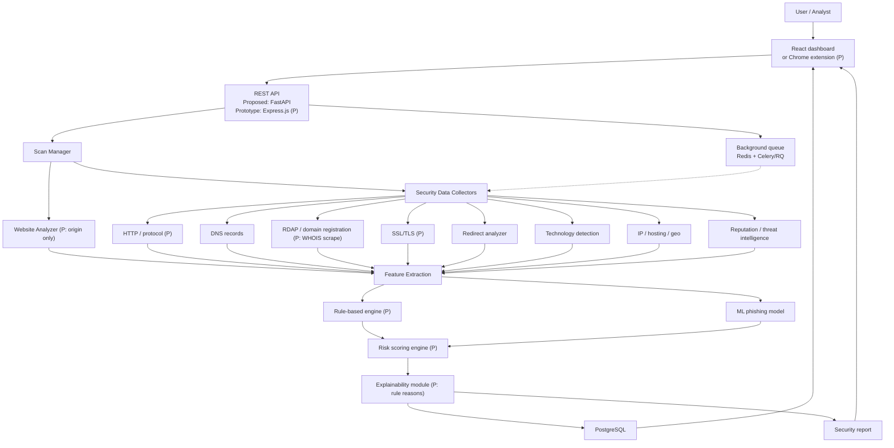

# Fig. 1. WebSentinel system architecture (solid = implemented, dashed = planned).

The diagram below is source for later conversion into an IEEE two-column figure. Solid boxes denote modules in the *proposed* capstone architecture. The current prototype implements only the subset marked `(P)`.

**Caption (IEEE):** Fig. 1. Proposed architecture of the WebSentinel security assessment system. Modules marked (P) are present in the current Chrome-extension prototype.

**Status note:** FastAPI, React, PostgreSQL, Redis, Celery/RQ, DNS, RDAP client, redirect, technology, IP/hosting, threat-intelligence, ML, SHAP, and report-generation modules are *proposed*. The prototype uses Express.js, a Manifest V3 popup, HTTPS/SSL/WHOIS collectors, and a rule-based score.
