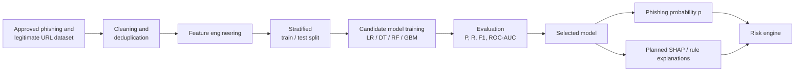

# Fig. 3. Planned machine-learning phishing classification pipeline.

This pipeline is *proposed* for the second semester. No trained model, notebook, dataset file, or SHAP output was present in the inspected WebSentinel repository.

**Caption (IEEE):** Fig. 3. Planned machine-learning pipeline for phishing probability estimation. No experimental metrics are reported because no trained model was found.

**Candidate models (not claimed as trained):**
- Logistic Regression (interpretable linear baseline)
- Decision Tree (rule extraction)
- Random Forest (strong tabular baseline in prior work)
- Gradient boosting (XGBoost / similar)

**Candidate features (proposed):** URL length, HTTPS usage, domain age, dot and subdomain counts, digits in hostname, special characters, redirect count, TLS validity, IP-literal host, suspicious keywords, login-form cues, reputation result.

**Required before results can be filled:** dataset name and license, class counts, split ratios, selected algorithm, and measured metrics. Do not invent values.
