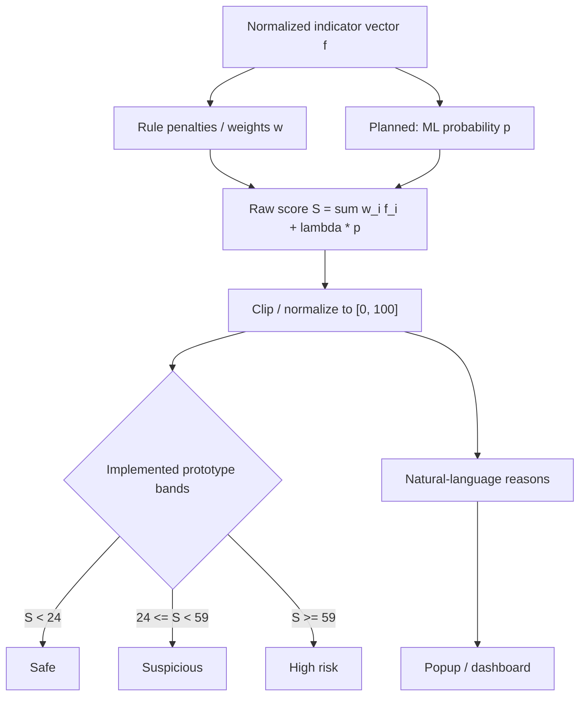

# Fig. 4. Risk-score pipeline of WebSentinel.

The current prototype uses only the left (rule) path. The right (ML) path and the 0--20 / 21--40 / ... banded categories are proposed and not experimentally tuned.

**Caption (IEEE):** Fig. 4. Risk-score pipeline. Prototype bands are taken from `backend/testingmain.js`. The five-level academic bands in the paper body are proposed and must be tuned before use.

**Implemented additive penalties (from source, not experimentally validated):**

| Indicator | Penalty / bonus |
|---|---|
| Missing HTTPS | +20 |
| Missing or invalid TLS certificate | +20 |
| Certificate expires in fewer than 7 days | +3 |
| Domain age < 7 days | +35 |
| Domain age < 1 month | +25 |
| Domain age < 6 months | +15 |
| Domain age < 1 year | +8 |
| WHOIS updated in last 7 days | +10 |
| WHOIS updated in last 30 days | +6 |
| HTTPS and DNSSEC reported as signed | -3 |
| Floor | `max(S, 0)` |

Domain-age penalties are mutually exclusive (the first matching age bucket is applied).
