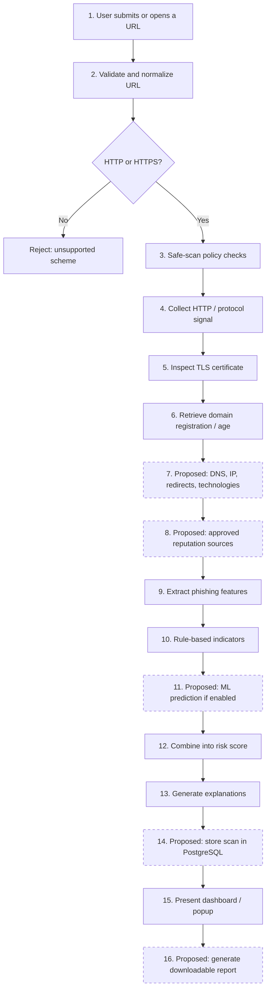

# Fig. 2. Website scanning workflow of WebSentinel.

Solid steps are implemented in the current prototype. Dashed steps are proposed for the remaining capstone work.

**Caption (IEEE):** Fig. 2. End-to-end website scanning workflow. Dashed stages are planned and are not claimed as implemented.

**Prototype mapping:**
1. Chrome `activeTab` reads the current tab URL.
2. Client and server reject `chrome:`, `file:`, and non-`http(s)` schemes.
3. Path and query are stripped; only `scheme + hostname` is sent.
4--6. Protocol, `ssl-checker`, and WHOIS scrape run with 8 s timeouts.
7--16 except scoring/UI: not implemented in the inspected repository.
